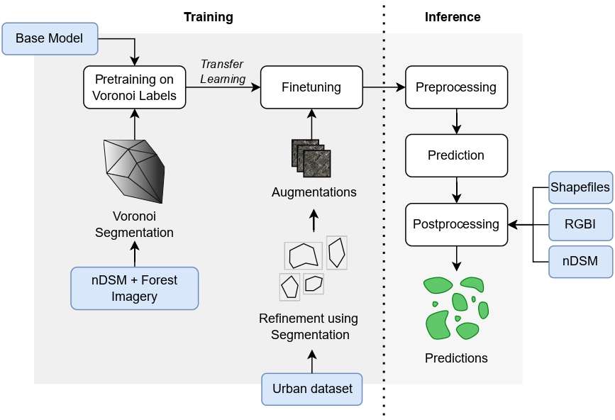
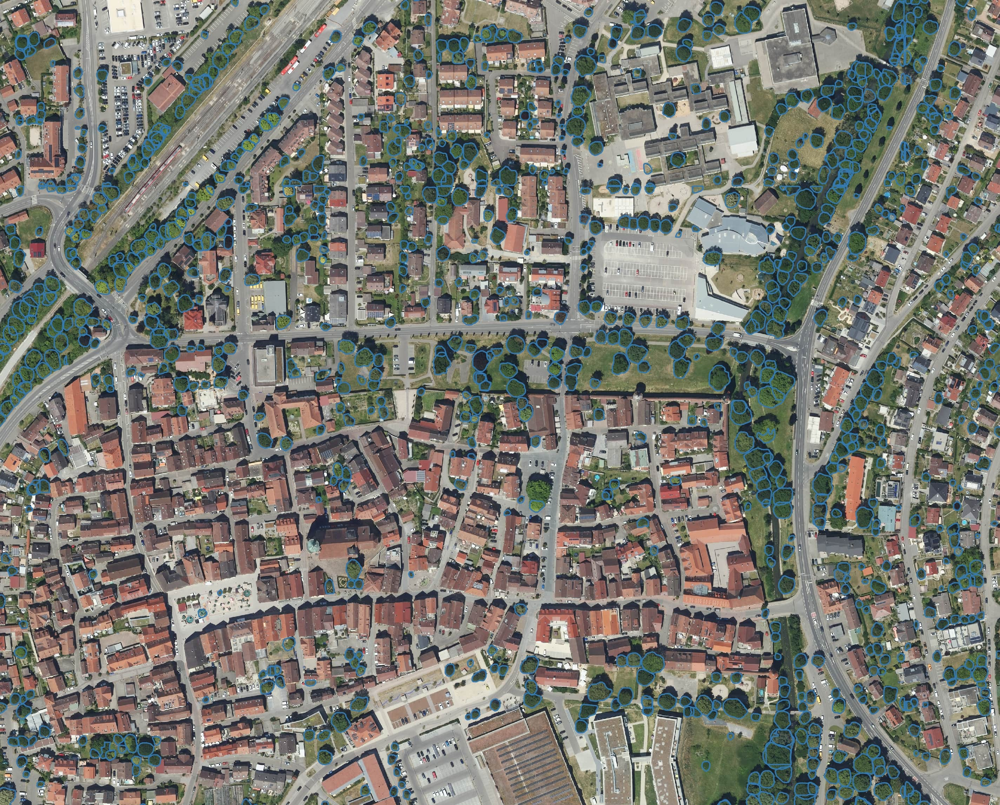
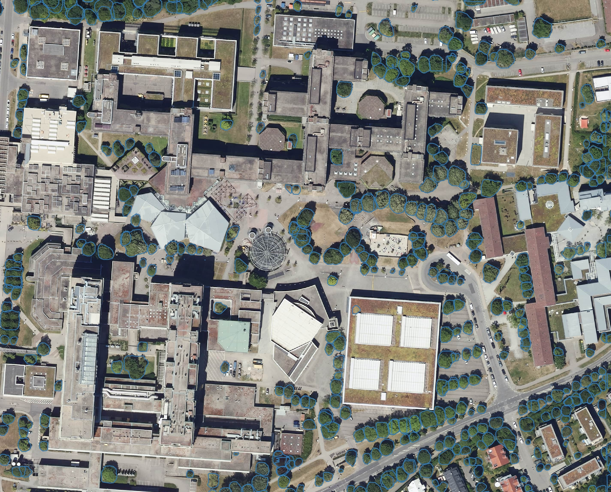
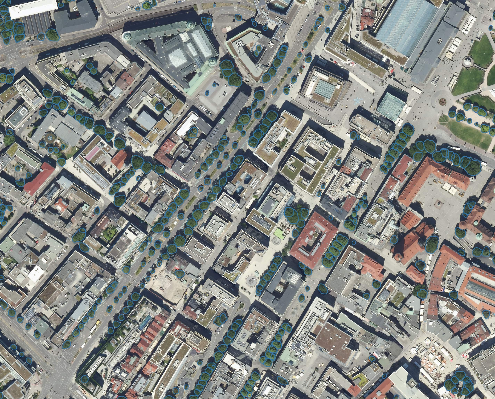
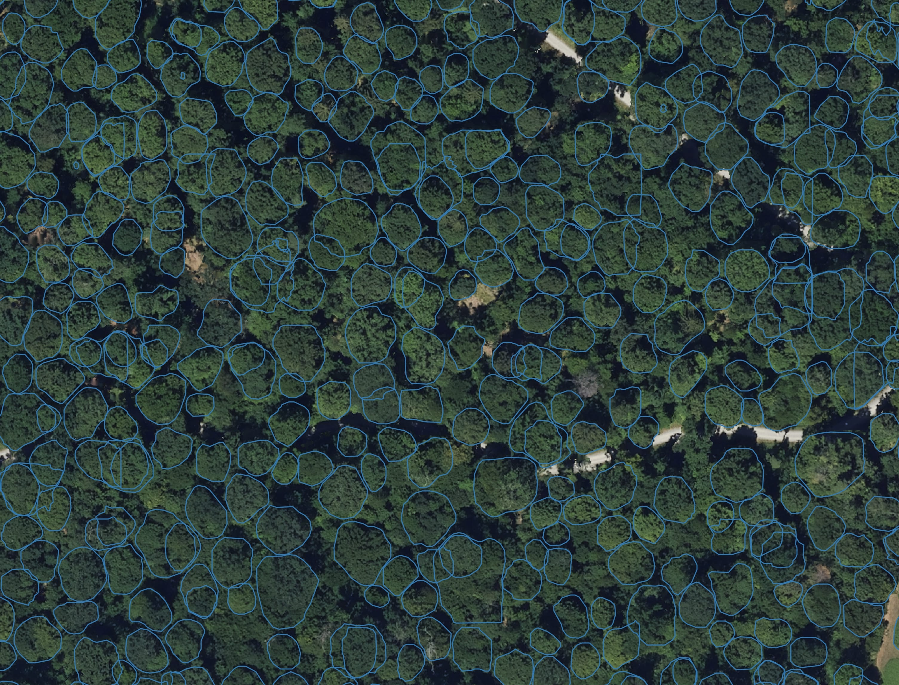
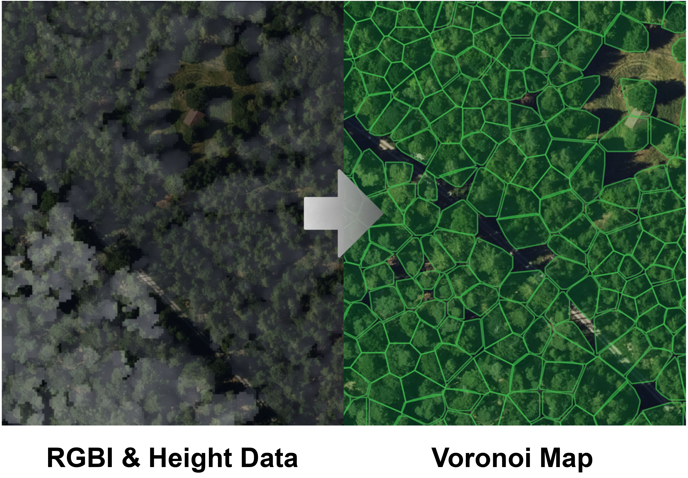

# TreeDetection
Python Software for countrywide detection and delienation of tree crowns based on a trained ResNet Model. Developed by [Luca Reichmann](https://github.com/reichmla), [Jonas Nasimzada](https://github.com/JonasNasimzada), [Alina Roitberg](https://aroitberg.github.io/), and [Jonas Geiselhart](https://github.com/Jonetz) at the University of Stuttgart in Corporation with the [Office of Geoinformation and Land-development Baden-Württemberg](https://www.lgl-bw.de/).

## Usage
In order to infer custom images, a config with all parameters must be constructed and a function can be called to execute inference based on all parameters in the config. 

The config can either be given as a YAML file or it can be hardcoded as directory. Here the input directories, models, and filename format. Please refer to the YAML in the reposito and the get config method to see all tuneable parameters. 

The primary functions to be used are in the main file, the process_files method is designed self contained and works only with the given parameters, if you choose to rely on the single functions to have more flexibility, you can also use preprocess_files, predict_tiles, and postprocess_files. In Order for this to work, the corresponding data from the previous steps should be made available before calling any of these methods.

The program can be executed with either one or two models based on whats given in the config, if two models are choose a 

## Additional Data 
Additional data such as models, example images and height maps, training datasets can be found [here](https://placeholder.com/).

## Requirementes
The program requires a gpu with an adequate installed cuda version for training and inference.
Further the following libaries are used:

```python
affine
aiofiles
cupy_cuda113
detectron2
fiona
geopandas
matplotlib
numba
numpy
opencv_python
pandas
pycocotools
PyYAML
rasterio
scikit_learn
scipy
Shapely
skimage
torch
```
Typically rasterio and geopandas require some form of [GDAL](https://gdal.org/en/stable/), there are many versions and it often conflicts with torch or detectron, so watch out for this while installation. 
Additionally detectree in version 1.0.8 is needed for training. This can be downloaded [here](https://github.com/PatBall1/detectree2/releases).

## Training and Inference 

Illustration of the different steps during training and inference, that can be applied through the framework.



## Supplementary Data 
We provide supplementary data for training the models, segmentation of the box annotations to more fine grained annotations, generation of autolabels, and model evaluation.

### Viusal Samples
Sample in Baden-Württemberg, Southern Germany


Sample of the University of Stuttgart


Sample of Stuttgart downtown


Sample of a forest near the University


Illustration of our autolabel generation using height maps, as given in the supplementary material 

